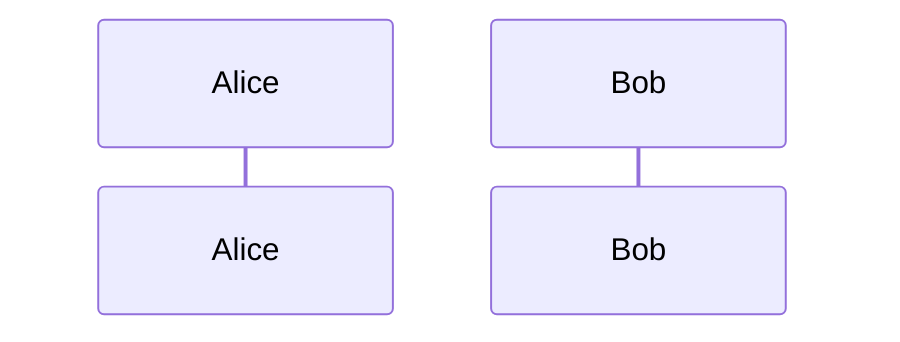
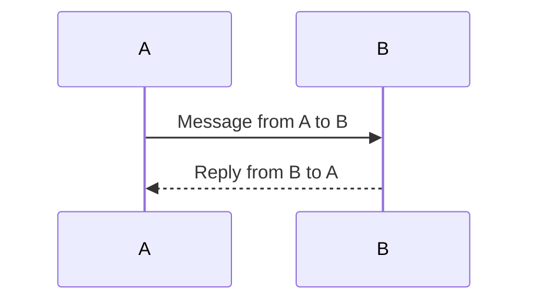

### How to Write Sequence Diagrams in Mermaid

#### Basic Syntax

- Define participants: Use `participant` followed by an alias, optionally followed by a label.


---

- Arrows: Use `->>` for solid arrows (messages) and `-->>` for dashed arrows (replies or acknowledgments).


#### Adding Notes

- Use `Note` to add annotations. Place notes `over`, `left of`, or `right of` participants.
  ```mermaid
  Note over A: This is a note over A
  Note left of B: This is a note to the left of B
  ```

#### Loops and Conditions

- `loop`: To signify repeated actions.
- `alt` or `opt`: To show conditional statements.
  
  ```mermaid
  loop Every Minute
    A->>B: Ping
  end

  alt Successful Ping
    B->>A: Ack
  else Timeout
    A->>A: Resend Ping
  end
  ```

#### Grouping

- Use `group` to encapsulate a block of messages under one title.
  
  ```mermaid
  group Initialization
    A->>A: Setup variables
    A->>B: Send initial data
  end
  ```

#### Styling

- Mermaid doesn't offer a lot of built-in styling options, but you can sometimes tweak styles depending on how you render the Mermaid code.

#### Combining All Concepts

Here's a comprehensive example combining these elements:

```mermaid
sequenceDiagram
  participant A as Alice
  participant B as Bob

  Note over A,B: Example Sequence Diagram

  loop Every Message
    A->>+B: send message
    Note right of B: Check message
    B-->>-A: send ACK
  end
  
  alt Message received
    A->>B: Next Message
  else Timeout
    A->>A: Resend Message
  end
  
  group Termination
    A->>B: Disconnect
    Note over A: Cleanup
  end
```

---

This should give you a good starting point for creating your own sequence diagrams in Mermaid.