#game_development 

[The original documentation](https://mermaid.js.org/syntax/flowchart.html)


# Flowcharts

Flowcharts are composed of 
- **nodes** (geometric shapes) and 
- **edges** (arrows or lines). 

The Mermaid code defines how **nodes** and **edges** are made and accommodates different arrow types, multi-directional arrows, and any linking to and from subgraphs.

> If you are using the word "end" in a Flowchart node, capitalize the entire word or any of the letters (e.g., "End" or "END"), or apply this [workaround](https://github.com/mermaid-js/mermaid/issues/1444#issuecomment-639528897). Typing "end" in all lowercase letters will break the Flowchart.

## Node
This is the default:

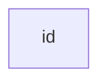
---
## Node w/ text


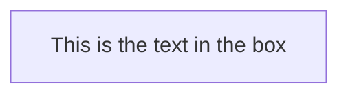

---
## Node w/ unicode

Use `"` to enclose unicode text
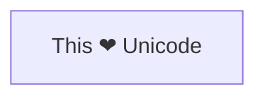
---
## Node w/ .md formating
Use double quotes and back-ticks to enclose the markdown text.
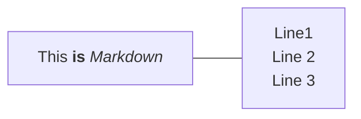

---
# Direction

## TD (Top Down)
or **TB** (Top Bottom)
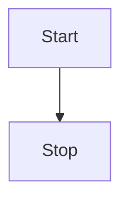
---
## LR (Left --> Right)

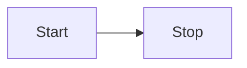
---
## RL (Right --> Left)
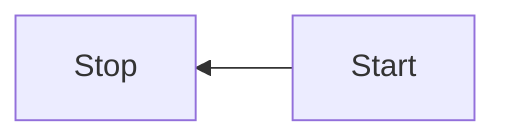
---
## BT (Bottom --> Top)
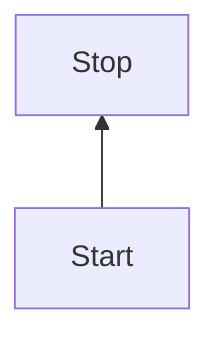

---

# Shape

## Round Edges

> $(\text{Wrap your text in parentheses})$

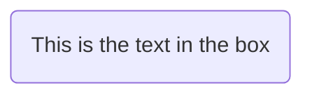

---

## Oval Shape

> $([\text{Wrap your text in brackets, and then parentheses}])$


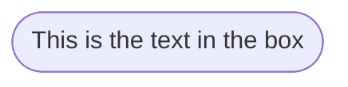

---

## Subroutine Shape

This barely shows up on my machine so just don't use this one

> $\text{[[Wrap your text in double-brackets]]}$

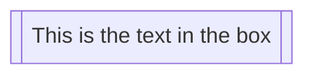

---

## Cylinder Shape 

> $[(\text{Wrap your text in parentheses, and then brackets})]$
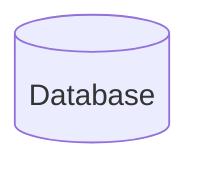

---
## Circle Shape

> $((\text{Wrap your text in double-parentheses}))$

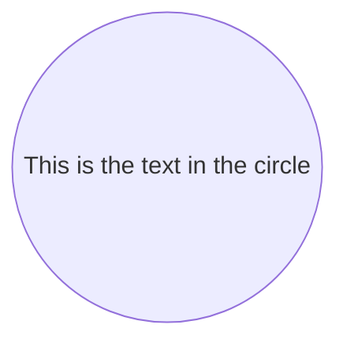

---

## Asymmetric Shape

> $>\text{This is the text in the box}]$

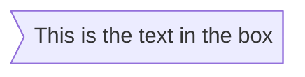

`NOTE: only the shape above is possible and not its mirror.`

---

## Diamond Shape

> $\{ \text{Wrap with Brackets} \}$

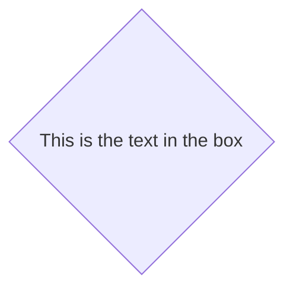

---

## Hexagon Shape

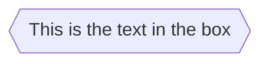

---

## Parallelogram

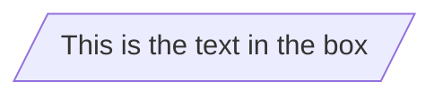

---
### Parallelogram alt

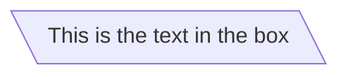

This is the text in the box

---

## Trapezoid

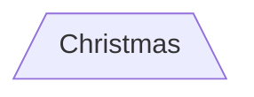

---

### Trapezoid alt

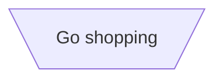
---
### Double circle
```mermaid
flowchart TD
    id1(((This is the text in the circle)))
```

---

