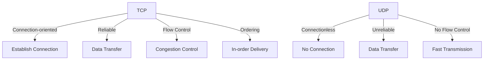

#fall2023 #COSC-350 #it #SY0-601 

---
## Definition

The Transport Layer is the fourth layer in the OSI ([[Open Systems Interconnection]]) model and is responsible for end-to-end communication and data flow control between devices on different networks.

---
## Objectives of the Transport Layer

1. **End-to-End Communication**: Establish a connection between the source and destination.
2. **Reliability**: Ensures that data is delivered correctly and in order.
3. **Flow Control**: Manages the rate of data transmission between devices.
4. **Multiplexing**: Combines multiple streams of data for transmission.
5. **Error Detection and Correction**: Detects and corrects errors in transmitted data.

---

---

## Functions of the Transport Layer

### 1. Segmentation and Reassembly

- Splits data into smaller segments for easier transmission.
- Reassembles segments at the destination.
### 2. Connection Establishment and Termination

- Uses handshaking mechanisms to establish and terminate connections.
### 3. Error Detection

- Adds checksums to detect corrupted data.
### 4. Flow Control

- Uses windowing techniques to control the flow of data.
### 5. Port Addressing

- Uses port numbers to distinguish different services on the same device.
---

## Common Transport Layer Headers

|Field|TCP|UDP|
|---|---|---|
|Source Port|✓|✓|
|Destination Port|✓|✓|
|Sequence Number|✓|✕|
|Acknowledgment Number|✓|✕|
|Checksum|✓|✓|

---
## Quality of Service (QoS)

- **Best Effort**: No guarantee of data delivery, no acknowledgment.
- **Reliable**: Acknowledgment-based, ensures data integrity.
- **Real-Time**: For applications like VoIP and streaming, may use UDP for faster data delivery.

---

## TCP vs UDP

- **TCP**: 
  - Ideal for applications requiring high reliability and data integrity.
  - Features like 'windowing' and 'retransmission' help maintain data integrity.
  - Supports large data sizes through segmentation and reassembly.
  - Due to its complexity, it usually has higher latency compared to UDP.

- **UDP**: 
  - Ideal for real-time, fast applications where loss of some data is acceptable.
  - Does not require an initial setup time, reducing latency.
  - Lower overhead due to a simpler header and lack of connection state.
  - Often used in DNS, DHCP, and streaming applications.

### Mermaid Diagram: How TCP and UDP Work

```mermaid
graph TD

    subgraph "TCP Workflow"
        A1[Three-Way Handshake]-->B1[Establish Connection]
        B1-->C1[Data Transfer]
        C1-->D1[Acknowledgment]
        D1-->E1[Tear-Down Connection]
    end

    subgraph "UDP Workflow"
        F1[Data Transfer]
    end

    classDef tcpClass fill:#222222,stroke:#333,stroke-width:2px;
    classDef udpClass fill:#000,stroke:#333,stroke-width:2px;

    class A1,B1,C1,D1,E1 tcpClass;
    class F1 udpClass;

```

### Summary

Both TCP and UDP have their pros and cons and are chosen based on the requirements of the specific application. TCP is reliable, provides guaranteed delivery through acknowledgments, and has built-in congestion control mechanisms. UDP, on the other hand, is faster and ideal for real-time applications where some packet loss is acceptable. Both have a similar MTU size, but the header size and the safe payload size differ due to their functionalities.

| Feature            | TCP                  | UDP                  |
|--------------------|----------------------|----------------------|
| Connection         | Connection-oriented  | Connectionless       |
| Speed              | Slower due to handshaking and acknowledgments | Faster, no handshaking or acknowledgments |
| Reliability        | High                 | Low                  |
| Ordering           | Yes                  | No                   |
| Error Checking     | Comprehensive error checking and correction | Minimal error checking |
| Use Case           | File transfer, Email, Web browsing | Streaming, VoIP, Gaming |
| MTU (Maximum Transmission Unit) | Generally 1500 bytes on Ethernet  | 0 ~ 65,507 bytes  |
| Header Size        | 20 bytes minimum, can go up to 60 bytes with options | 8 bytes |
| Average Safe Size  | ~1460 bytes (1500 - 20 bytes for IP header - 20 bytes for TCP header)  | ~1472 bytes for Ethernet, up to ~65,507 bytes for a standalone UDP packet  |
| Congestion Control | Yes, built-in features like slow start, congestion avoidance | No built-in features |
| Acknowledgment     | Required, ACK packets sent for received segments | Not required |
| Windowing          | Yes, for flow control | No                   |
| Stateful           | Maintains state of the connection | Stateless         |
| Three-Way Handshake| Yes                  | No                   |
| Complexity         | More complex due to reliability features | Simpler |
### Features Explained

#### Connection

- **TCP**: Connection-oriented, meaning it establishes a reliable connection before data transmission.
- **UDP**: Connectionless, meaning it doesn't establish a connection and directly sends data.

#### Speed

- **TCP**: Generally slower due to the need for establishing a connection, acknowledgment, and other features that ensure reliable data transfer.
- **UDP**: Faster since there's no connection setup or acknowledgment.

#### Reliability

- **TCP**: High reliability, ensures that data arrives correctly and in order.
- **UDP**: Low reliability, no guarantee that data will arrive or do so in the correct sequence.

#### Ordering

- **TCP**: Maintains the order of data packets.
- **UDP**: No guarantee on the ordering of data packets.

#### Error Checking

- **TCP**: Comprehensive error checking and data recovery.
- **UDP**: Minimal error checking, no recovery.

#### Use Case

- **TCP**: Ideal for applications like file transfer, email, and web browsing where data integrity is crucial.
- **UDP**: Suited for real-time applications like streaming, VoIP, and gaming where some packet loss is acceptable.

#### MTU (Maximum Transmission Unit)

- **TCP**: Typically 1500 bytes on Ethernet networks.
- **UDP**: Ranges from 0 to 65,507 bytes.

  > MTU refers to the maximum size of a data packet that can be sent over a network.

#### Header Size

- **TCP**: Minimum of 20 bytes, can extend up to 60 bytes with optional fields.
- **UDP**: 8 bytes.

  > Header size is the length of the metadata that is prepended to the data payload for protocol-specific handling.

#### Average Safe Size

- **TCP**: Around 1460 bytes when considering Ethernet MTU and header sizes.
- **UDP**: Around 1472 bytes for Ethernet, up to 65,507 bytes for a standalone UDP packet.

  > Average Safe Size refers to the actual data payload size that can be sent without fragmenting the packet.

#### Congestion Control

- **TCP**: Includes mechanisms like slow start and congestion avoidance.
- **UDP**: No built-in congestion control features.

  > Congestion Control refers to techniques used to control the flow of data to prevent network congestion.

#### Acknowledgment

- **TCP**: Required, acknowledgment packets (ACK) are sent for each received packet.
- **UDP**: Not required, no acknowledgments for received packets.

  > Acknowledgment refers to the confirmation of data receipt.

#### Windowing

- **TCP**: Yes, employs windowing for flow control.
- **UDP**: No windowing.

  > Windowing refers to sending a few packets at a time and waiting for acknowledgment before sending more.

#### Stateful vs Stateless

- **TCP**: Stateful, maintains connection state and parameters.
- **UDP**: Stateless, each packet is independent.

  > Stateful/Stateless refers to whether the protocol keeps track of the connection state.

#### Three-Way Handshake

- **TCP**: Employs a three-way handshake for connection establishment.
- **UDP**: No handshake, as there's no connection to establish.

  > Three-Way Handshake refers to the initial sequence of steps for setting up a connection.

#### Complexity

- **TCP**: More complex due to features ensuring reliability and data integrity.
- **UDP**: Simpler and more lightweight.

  > Complexity refers to the intricacy of the protocol, considering features like error checking, handshaking, etc.

---
## Summary

The Transport Layer is vital for enabling reliable, efficient data communication between devices on different networks. It provides functionalities like connection management, data segmentation, error detection, and flow control. The choice between TCP and UDP depends on the requirements of the application in terms of speed and reliability.

