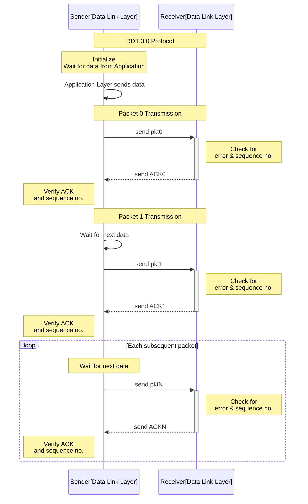

```mermaid
sequenceDiagram
  participant Sender as Sender[Data Link Layer]
  participant Receiver as Receiver[Data Link Layer]

  Note over Sender,Receiver: RDT 3.0 Protocol

  %% Initialization Phase
  Note over Sender: Initialize<br/>Wait for data from Application
  Sender->>Sender: Application Layer sends data

  %% First packet transmission
  Note over Sender,Receiver: Packet 0 Transmission
  Sender->>+Receiver: send pkt0
  Note right of Receiver: Check for<br/>error & sequence no.
  Receiver-->>-Sender: send ACK0
  Note left of Sender: Verify ACK<br/>and sequence no.

  %% Second packet transmission
  Note over Sender,Receiver: Packet 1 Transmission
  Sender->>Sender: Wait for next data
  Sender->>+Receiver: send pkt1
  Note right of Receiver: Check for<br/>error & sequence no.
  Receiver-->>-Sender: send ACK1
  Note left of Sender: Verify ACK<br/>and sequence no.

  %% Loop for remaining packets
  loop Each subsequent packet
    Note over Sender: Wait for next data
    Sender->>+Receiver: send pktN
    Note right of Receiver: Check for<br/>error & sequence no.
    Receiver-->>-Sender: send ACKN
    Note left of Sender: Verify ACK<br/>and sequence no.
  end

```

I used [[🧜‍♀️ Mermaid Sequence Diagrams]] for this.

