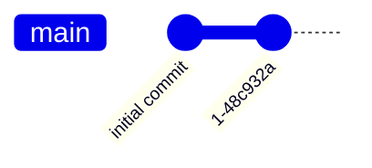
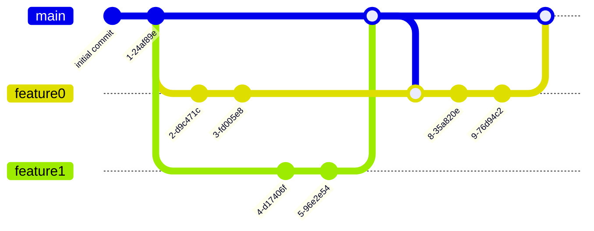
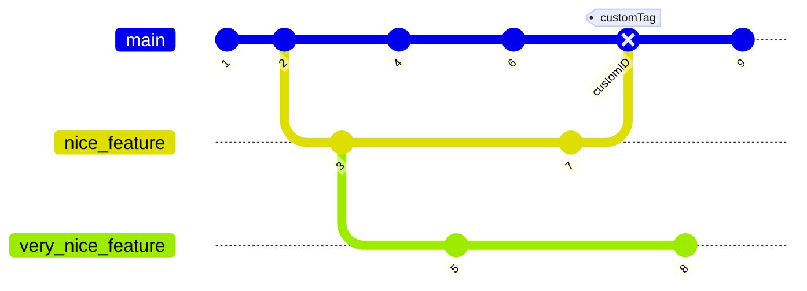
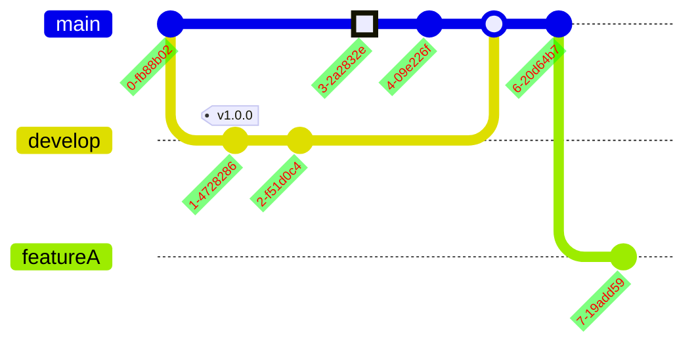
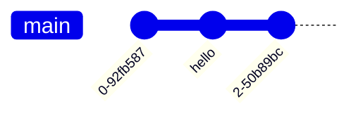

#game_development 

```mermaid
gitGraph
	commit id: "initial commit"
	commit

```
---

```mermaid
gitGraph
	commit id: "initial commit"
	commit
	branch feature0
	commit
	commit
	
	checkout main
	branch feature1
	commit
	commit
	
	checkout main
	merge feature1
	
	checkout feature0
	merge main
	commit
	commit
	
	checkout main
	merge feature0

```
---

```mermaid
gitGraph
	commit id: "1"
	commit id: "2"
	branch nice_feature
	checkout nice_feature
	commit id: "3"
	checkout main
	commit id: "4"
	checkout nice_feature
	branch very_nice_feature
	checkout very_nice_feature
	commit id: "5"
	checkout main
	commit id: "6"
	checkout nice_feature
	commit id: "7"
	checkout main
	merge nice_feature id: "customID" tag: "customTag" type: REVERSE
	checkout very_nice_feature
	commit id: "8"
	checkout main
	commit id: "9"
```
---

```mermaid
%%{init: { 'logLevel': 'debug', 'theme': 'default' , 'themeVariables': {
              'commitLabelColor': '#ff0000',
              'commitLabelBackground': '#00ff00'
       } } }%%
       gitGraph
       commit
       branch develop
       commit tag:"v1.0.0"
       commit
       checkout main
       commit type: HIGHLIGHT
       commit
       merge develop
       commit
       branch featureA
       commit
```

```mermaid
gitGraph
	commit
	commit id: "hello"
	commit
```

