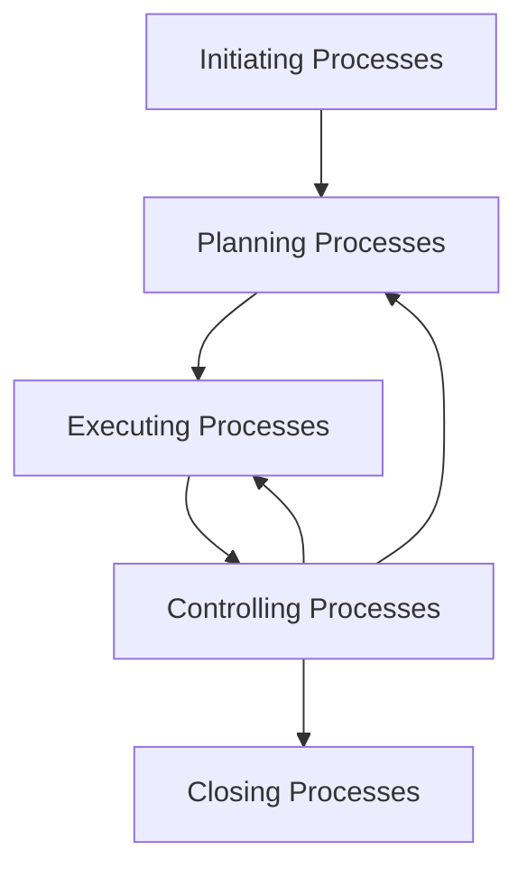

---
tags:
  - fall2023
---

- A project is a temporary endeavor; it has a start and end date.

Project Charter
- This is a written, formal document with signatures.
- formally recognizes the project existence
- authorizes project
- identifies project manager and authority levels
- describes high level business case
- provides goals/objectives
- approved by senior management

> Quality is fit for use and conforms to the requirements.

Project Contraints
- Time
- Scope
	- Scope inclusions
	- Scope exclusions
- Cost
	- Salaries
	- Materials
	- Equiptment
	- Subcontractors or Vendors

- Initiating
- Planning
- Executing
- Controlling
- Closing

> Arrows show flow of information

Software Scope
- Functions and features to be delivered
- Data input and output
- Content presented to users
- Performance, contraints, scope.