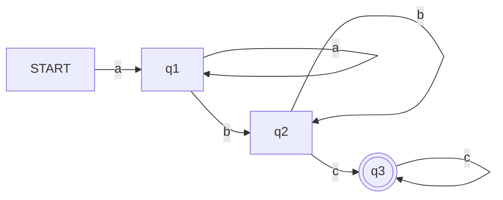

---
tags:
  - COSC-455
  - fall2023
---

### Regular Expressions for Languages over $\Sigma=\{0,1\}$

![[cosc455_assigment2.pdf]]

#### (a) $\{w\in\Sigma^{\star}\vert w \text{ begins with a 0 and ends with a 1}\}$ 

Regular Expression: 
$0\Sigma^{\star}1$

---

#### (b) $\{w\in\Sigma^{\star}\vert w \text{ contains at least four 0s}\}$ 

Regular Expression: 
$\Sigma^{\star}0\Sigma^{\star}0\Sigma^{\star}0\Sigma^{\star}0\Sigma^{\star}$

---
#### (c) $\{w\in\Sigma^{\star}\vert w \text{ contains the substring 1101}\}$ 

Regular Expression: 
$\Sigma^{\star}1101\Sigma^{\star}$

---
#### (d) $\{w\in\Sigma^{\star}\vert w \text{ has length at least 4 and its third symbol is a 0}\}$ 

Regular Expression: $\Sigma\Sigma0\Sigma\Sigma^{\star}$

---

#### (e) 
$$\{w\in\Sigma^{\star}\vert w \text{ begins with a 0 and has even length, or begins with a 1 and has odd length}\}$$
Regular expression:
$0(\Sigma\Sigma)^{\star} \vert 1(\Sigma\Sigma)^{\star}\Sigma$ 

---
#### (f) $\{\epsilon, 0\}$

Regular Expression:
$\epsilon \vert 0$

---

#### (g) The empty set

Regular Expression: $\emptyset$

---
#### (h) All strings over $\Sigma$

Regular Expression: $\Sigma^{\star}$

---
#### (i) All strings over $\Sigma$ except the empty string

Regular Expression: $\Sigma^{+}$

---
### 2. Strings in Languages over $\Sigma = \{a,b\}$

For each of the following languages, give...
- two strings that `are` members and 
- two strings that `are not` members

- **(a) $a^{\star}b^{\star}$
	- members
		- $\epsilon$
		- $bbaa$
	- non-members
		- $ab$
		- $baab$
- **(b)** $a(ab)^{\star}b$
	- members
		- $ab$
		- $abb$
	- non-members
		- $ba$
		- $aa$
- **(c)** $a^{+}\cup b^{+}$
	- members
		- $a$
		- $bb$
	- non-members
		- $\epsilon$
		- $ab$
- **(d)** $(aba)^{\star}$
	- members
		- $aba$
		- $\epsilon$
	- non-members
		- $abaa$
		- $ab$
- **(e)** $\Sigma a \Sigma^{\star}b\Sigma^{\star}a\Sigma$
	- members
		- $aabaa$
		- $babab$
	- non-members
		- $bbbaa$
		- $aaaaa$
- **(f)** $aba \cup bab$
	- members
		- $aba$
		- $bab$
	- non-members
		- $ab$
		- $ba$
- **(g)** $b(\epsilon \cup a)b$
	- members
		- $bb$
		- $bab$
	- non-members
		- $ba$
		- $ab$
- **(h)** $\Sigma^{\star}(a \cup ba \cup bb)\Sigma^{\star}$
	- members
		- $a$
		- $aaa$
	- non-members
		- none; this language allows any string over $\Sigma$ , as long as it contains at least one of $a$, $ba$, or $bb$ somewhere in it.

---

### 3. Regularity of Languages over $\Sigma = \{a, b, c\}$

#### (a) $\{a^{2i}b^{j} \vert i, j \ge 1\}$

- This language is **not** regular because it requires counting (to ensure the number of $a$'s are in multiples of 2)
- Counting indicates a non-regular language. Finite automata does not have memory for this.

---
#### (b) $\{a^{n}b^{m}c^k \vert n, m, k \ge 1\}$

- This language is regular because it doesn't require counting. (It only needs one of each member)

---
#### (c) $\{a^{n}b^{n+m}c^k \vert n, m, m \ge 1\}$

- This language is **not** regular. It requires counting the number of $a$'s and $b's$ to make sure that the number of $b$'s is at least as many as the number of $a$'s'. 
- Counting indicates a non-regular language. Finite automata does not have memory for this.