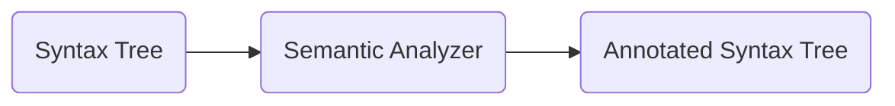
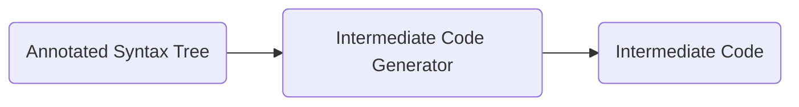
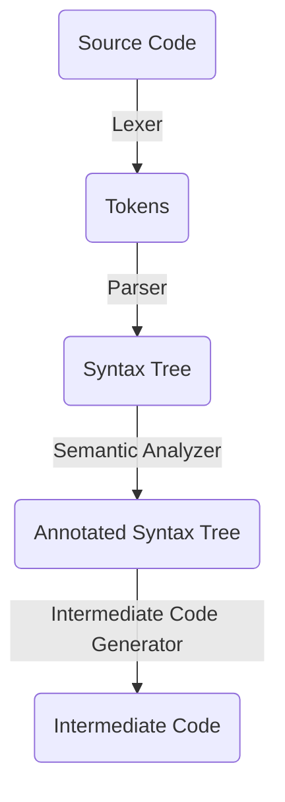

### Compilers and Interpreters

Both compilers and interpreters are used to process high-level, human-readable source code into machine-understandable code, but they do it in different ways:
- **Compiler:** Translates the entire source code into machine code before execution.
- **Interpreter:** Translates and executes source code line by line.

### [[Abstract Syntax Tree]] (AST)
An AST is a tree representation of the structure of source code. Each node in the tree denotes a construct occurring in the source code. It abstracts away the syntactic details, focusing on the underlying meaning or logic of the code.

### Compilation Process
The process of converting source code into machine code involves several stages:

#### 1. [[Lexical Analysis]]
- **Purpose:** To convert the input source code into a sequence of tokens.
- **Component:** Lexer or Lexical Analyzer
- **Output:** Tokens

#### 2. Syntax Analysis
- **Purpose:** To check the tokens for syntactical correctness and generate a syntax tree.
- **Component:** Parser
- **Output:** Syntax Tree

#### 3. Semantic Analysis
- **Purpose:** To check the syntax tree for semantic errors and enrich it with additional information, ensuring that it complies with the language's semantic rules.
- **Component:** Semantic Analyzer
- **Output:** Annotated Syntax Tree

- **Type Checking:** Part of Semantic Analysis. Verifies whether the operands of an operator match the expected types.

#### 4. Intermediate Code Generation
- **Purpose:** To convert the annotated syntax tree into an intermediate code, which is platform-independent.
- **Output:** Intermediate Code

### Summary Diagram

- **Interpreters** might directly interpret the AST or another intermediate representation.
- **Compilers** further convert the intermediate code to machine code, optimizing it for performance. 
- Both **compilers** and **interpreters** play crucial roles in bridging the gap between high-level programming languages and low-level machine instructions, enabling the development of efficient and effective software applications.