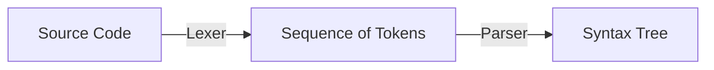

---
tags:
  - COSC-455
  - fall2023
---

## In relation to [[Project 1]]

### 1. Tokenization
**Tokens:** Recognized based on the project grammar, tokens include keywords (e.g., "program", "bool", "int"), operators (e.g., ":=", "+", "-", "<"), identifiers, literals (e.g., IntegerLiteral, BooleanLiteral), and punctuation marks (e.g., ":", ";", ",").

### 2. Recognizing Tokens
- Keywords and Operators are recognized by direct string matching.
- Identifiers are recognized by the rule `Identifier = Letter { Letter | Digit | "_" }`.
- Integer Literals are recognized by the rule `IntegerLiteral = Digit { Digit }`.

### 3. Handling White Spaces and Comments
- White spaces can occur anywhere but not within terminal symbols and are typically ignored.
- Comments beginning with "//" are also ignored during tokenization.

### 4. Maximum Munch Rule
According to this rule, the lexer should read characters and form tokens in such a way that it produces the longest possible token in the source code. For example, "if1" should be recognized as one identifier token, not as the keyword "if" followed by the digit "1".

## Lexical Analyzer Design
Designing a Lexical Analyzer for your project, based on the provided grammar, would primarily involve creating patterns that match the specified rules and breaking the input string down into the corresponding tokens. 



## Handling Errors
Errors in the Lexical Analysis phase could include unidentified symbols, improperly formed identifiers or literals, and unterminated comments. For instance, in your project, encountering a sequence of characters that does not match any of the defined token patterns would be considered an error.

## Practical Implementation
You can use Lexical Analysis tools or libraries available in various programming languages to implement the Lexer. For example, if you are working in Python, you might consider using a library like PLY (Python Lex-Yacc).

## Example Implementation:
Here's a simplified example of what a section of the Lexical Analyzer for your project might look like in Python, using PLY:

```python
import ply.lex as lex

tokens = (
    'PROGRAM', 'IDENTIFIER', 'INT', 'BOOL', 'IF',
    # Add the rest of the tokens as needed
)

t_PROGRAM = r'program'
t_IDENTIFIER = r'[a-zA-Z_][a-zA-Z_0-9]*'
t_INT = r'int'
t_BOOL = r'bool'
t_IF = r'if'

# Define other token patterns
# ...

# Ignoring whitespace
t_ignore = ' \t'

# Handling newline
def t_newline(t):
    r'\n+'
    t.lexer.lineno += len(t.value)

# Error handling
def t_error(t):
    print(f"Illegal character '{t.value[0]}'")
    t.lexer.skip(1)

lexer = lex.lex()
```

> This is a very basic illustration. In a complete implementation, I would need to handle all token types,  and consider edge cases.


