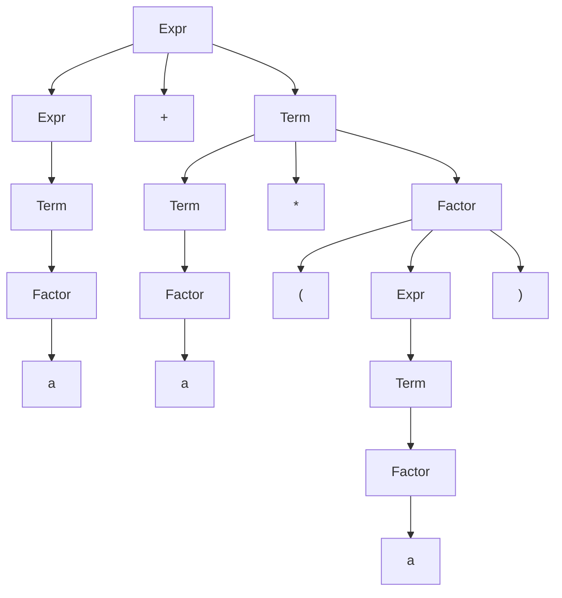

---
tags:
  - fall2023
  - COSC-455
---
# Context Free Grammars (CFGs)
---
## Introduction
> A Context-Free Grammar (CFG) is a powerful descriptive tool that can define languages that Finite State Machines (FSMs) (or [[Finite Automata]]) and [[Regular Expressions]] can't express. CFGs are a way to represent the syntax of programming languages, natural languages, and more.

---

## Basic Definitions
### Context-Free Grammar
> A CFG is defined by a 4-tuple $G = (V, \Sigma, R, S)$ where:
1. $V$ is the finite set of variables.
2. $\Sigma$ is the finite set of terminal symbols, disjoint from $V$.
3. $R$ is the finite set of rules. Each rule is defined as:
    - The left side is a variable.
    - The right side is a string consisting of variables and terminals.
4. $S$ is the start variable, $S \in V$.

### Example: Grammar $G_1$
The given example $G_1$ can be written as:
$$
\begin{align*}
	A &\rightarrow 0A1 \\
	A &\rightarrow B \\
	B &\rightarrow \#
\end{align*}
$$
- $Sigma = \{0, 1, \#\}$
- Variables $= \{A, B\}$
- $A$ is the start variable.

### Derivations
Derivations demonstrate how strings are generated in the language. They show a sequence of rule applications, starting from the start variable, leading to a string of terminal symbols.
- $A \Rightarrow 0A1 \Rightarrow 00A11 \Rightarrow 00B11$

### Language Generated by $G_1$
The language $L(G_1)$ consists of strings like $\{\#, 00\#11, 000\#111, 0000\#1111, \ldots\}$.

---

## Comparing with FSMs and Regular Expressions
1. **FSMs**: Finite State Machines can represent regular languages. All regular languages are also context-free, but not all context-free languages are regular.
2. **Regular Expressions**: These define regular languages and have similar limitations as FSMs.

Example: $L = \{a^nb^n \,|\, n \ge 1\}$ is not regular but is context-free.

---

## Advanced Concepts
### Parse Trees
Parse trees visually represent derivations in a hierarchical structure. A node labeled by a variable $A$ is connected to children that represent the variables and terminals in the rule $A \rightarrow \alpha$.

### Chomsky Normal Form (CNF)
A CFG is in Chomsky Normal Form if all its rules are of the form $A \rightarrow BC$ or $A \rightarrow a$, facilitating parsing and analysis.

---

## Exercises
### Context-Free Language $L_2$
$L_2 = \{a^nb^n \,|\, n \ge 0\}$
$L_2$ can be defined by a CFG:
$$
S \rightarrow aSb \,|\, \epsilon
$$

---

### Arithmetic Expressions
$G_3 = (V, \Sigma, R, \text{Expr})$
- $V = \{\text{Expr, Term, Factor}\}$
- $\Sigma = \{+, \times, a, (, )\}$

#### Rules

```
Expr --> Expr+Term | Term
Term --> Term*Factor | Factor
Factor --> (Expr) | a
```

### Reverse Exercise
$a + a \times (a)$ can be derived in $G_3$ and thus belongs in $L(G_3)$.



The parse tree represents the step-by-step breakdown of how the string $a + a \times (a)$ is derived from the initial start variable `Expr` in the context-free grammar $G_3$.

Here's what the tree is showing you:

1. **Start at `Expr1[Expr]`:** The entire expression $a + a \times (a)$ is an `Expr`.

2. **Split into `Expr2`, `+`, `Term1`:** The expression is split into another smaller expression `Expr2`, an addition operation `+`, and a term `Term1`. This corresponds to the rule $\text{Expr} \rightarrow \text{Expr} + \text{Term}$.

3. **Drill down `Expr2`:** It further boils down to a `Term` (`Term2`), which then simplifies to a `Factor` (`Factor2`), which then turns out to be the terminal `a`.

4. **Drill down `Term1`:** The term `Term1` also breaks down into a smaller term (`Term3`), a multiplication operation `*`, and another `Factor` (`Factor1`). This corresponds to the rule $\text{Term} \rightarrow \text{Term} \times \text{Factor}$.

5. **Drill down `Term3` and `Factor3`:** Both simplify to terminal `a`.

6. **Drill down `Factor1`:** This breaks down into an opening parenthesis `(`, another `Expr` (`Expr3`), and a closing parenthesis `)`. This corresponds to the rule $\text{Factor} \rightarrow ( \text{Expr} )$.

7. **Drill down `Expr3`:** It boils down to a `Term` (`Term4`), which then simplifies to a `Factor` (`Factor4`), which is the terminal `a`.

Each node represents a variable or a terminal from $G_3$, and each edge represents the application of a grammar rule from $G_3$. By following the tree from the root to the leaves, you can construct the original string $a + a \times (a)$, thereby proving that this string can be derived from $G_3$ and therefore belongs in $L(G_3)$.

---

$\text{input}, \text{stack}$
$a, b \rightarrow c$: when the machine reads an a from the input, it replaces the symbol b on the top of the stack with a c.

- if $a=\epsilon : \epsilon, b \rightarrow c$: the `machine` *reads* <u>nothing</u> from the `input`, *replaces* $b$ on top of the `stack` with a $c$.
- if $b=\epsilon: a, \epsilon \rightarrow c$: *reads* $a$ from the `input`, does not *pop* the `stack`, *pushes* $c$ into the `stack`.
- if $c = \epsilon : a, b \rightarrow \epsilon$: *reads* $a$, if the top of the `stack` is $b$, *pops* $b$, *pushes* <u>nothing</u> 