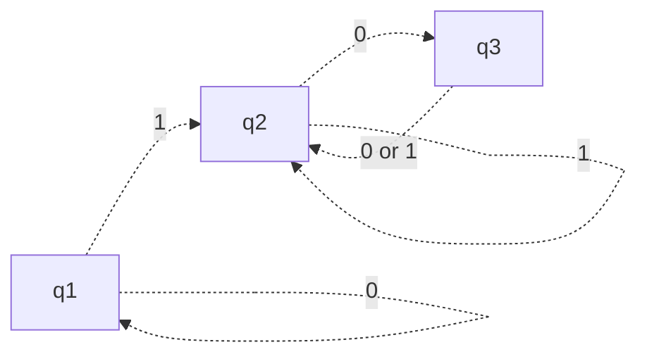
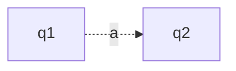
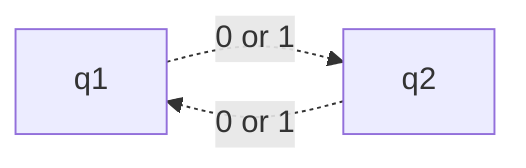

#COSC-455 #fall2023 
date: [[Aug 31, 2023]]

Also known as a Finite State Machine (FSM)
- We use $\Sigma$ to represent alphabet
- an alphabet is the set of possible inputs
- Alphabet = $\Sigma$ = $\{0, 1\}$ 

$M_1:$

- q2 is accepted state
- $m_1$ accepts all strings over $\Sigma$ that have at least one $1$, and the last $1$ is followed by an even number of 0's
- we need to use another notation to define this finite state machine

### What do we need ?
- initial state
- alphabet
- states
- transitions

- $\delta(q1,a) = q2$

> A finite automation is a 5-tuple
> $(Q, \Sigma, F, q_0, \delta)$, such that:
	1. $Q$ is a finite set of states,
	2. $\Sigma$ is a finite set of alphabet,
	3. $q_0 \in Q$ is the initial state,
	4. $F \subseteq Q$ is the set of accepted states
	5. $\delta: Q \times \Sigma \rightarrow Q$ is the transition function,

![[DFA_example.png]]

- $M_1 = \{q_1, q_2, q_3\}, \{ 0, 1\}, \delta, q_1, \{q_2\}$
	- $\{q_1, q_2, q_3\} = Q$
	- $\{ 0, 1\} = \Sigma$
	- $\{q_2\}=F$

- If $A$ is the set of all strings that machine $M$ accepts, we say that A is the language of machine $M$ and we write
	- $L(M) = A$
	- We also say that $M$ recognizes $A$ or $M$ accepts $A$

- A language is called <u>regular</u> if there exists some finite automation that accepts it.
	- Exercise: consider the language of all strings over $\Sigma = \{0,1\}$ whose length is even.
	- Is this language regular? Show your work
		- Yes

- Design a machine, $\Sigma = \{0, 1\}$ with odd number of 1's
