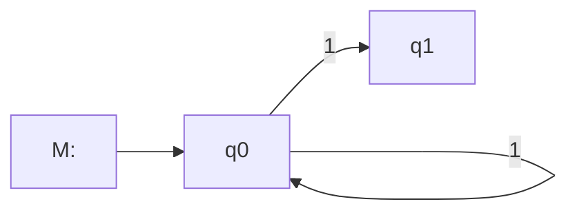
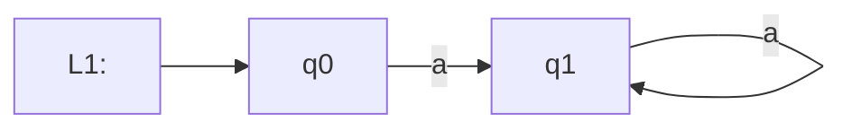
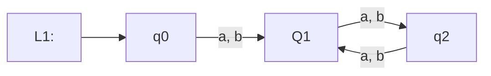

#fall2023 #COSC-455 

## Definition
> $R$ is a regular expression if
> 1. for some $a$ in alphabet $\Sigma \rightarrow$ every member of $\Sigma$ is a regular expression
> 2. $\epsilon$ is a regular expression.
> 	 $\epsilon \rightarrow \{ \epsilon \}$
> 3. $\emptyset$ is a regular expression
> 	 $\emptyset \rightarrow \{  \}$
> 4. $R_1 \cup R_2$, where $R_1$ and $R_2$ are regular expressions
> 5. $R_1 \circ R_2$, where $R_1$ and $R_2$ are regular expressions
> 6. $R_1^{\star}$, where $R_1$ is a regular expression

## Arithmetic Expressions

### Multiplication
- **Expression**: $3 \times 4 = 12$
  - **Operation**: The symbol $\times$ represents multiplication.

### Division
- **Expression**: $10 / 2 = 5$
  - **Operation**: The symbol $/$ represents division.

## Regular Expression Operations

### 1. Union (Set Union)
- **Definition**: Given two regular languages $A$ and $A$, their union is $A \cup B = \{w | w \in A \lor w \in B\}$.
  - **Explanation**: A regular language is essentially a set of strings. The union operation combines the sets \(A\) and \(B\), including all unique elements from both.
  
### 2. Concatenation
- **Definition**: For sets $A$ and $B$, $$A \circ B = \{w_1w_2 | w_1 \in A \land w_2 \in B\}$$
  - **Explanation**: Concatenation joins each string $w_1$ from set $A$ with each string $w_2$ from set $B$.

### 3. Kleene Star
- **Definition**: For set $A$, $$A^{\star} = \{x_1x_2\dots x_k | x_1 \in A \land k \ge 0\}$$
  - **Explanation**: The Kleene Star operation generates **all** possible strings by **concatenating** zero or more strings from set $A$.

## Additional Notes

- **Value of a Regular Expression**: The value of a regular expression is the language represented by that expression.

### Special Cases
- **Zero as a Regular Expression**: \(0\) is a regular expression representing the set \(\{0\}\).
- **One as a Regular Expression**: \(1\) is a regular expression representing the set $\{1\}$.
  - **Union of 0 and 1**: $0 \cup 1 = \{0, 1\}$

### Example
- **Kleene Star of Zero**: $0^{\star} = \{\epsilon, 0, 00, 000, 0000, \dots\}$
  - **Explanation**: This represents all possible strings formed by concatenating zero or more 0's, including the empty string $\epsilon$.

---
## New Notation and Regular Expression Equivalence

### Notation
- $\Sigma^+$ represents the set of all non-empty strings over the alphabet $\Sigma$.
- $\Sigma^{\star}$ represents the set of all strings over the alphabet $\Sigma$, including the empty string $\epsilon$.

### Regular Expression Equivalence
- $\Sigma^+ = \Sigma\Sigma^{\star} \equiv \Sigma^{\star}\Sigma$

This means that $\Sigma^+$ can be formed by taking a single symbol from $\Sigma$ and then appending zero or more symbols from $\Sigma$ (represented by $\Sigma^{\star}$).

The equivalence indicates that you can either start with a single symbol and then append the rest, or start with a string (possibly empty) and then make sure to append at least one symbol from $\Sigma$.

#### Examples
1. Let $\Sigma = \{a, b\}$
   - $\Sigma^+ = \{a, b, aa, ab, ba, bb, aaa, aab, ...\}$
   - $\Sigma\Sigma^{\star} = \{a, b, aa, ab, ba, bb, aaa, aab, ...\}$
   - $\Sigma^{\star}\Sigma = \{a, b, aa, ab, ba, bb, aaa, aab, ...\}$

2. Let $\Sigma = \{0, 1\}$
   - $\Sigma^+ = \{0, 1, 00, 01, 10, 11, 000, 001, ...\}$
   - $\Sigma\Sigma^{\star} = \{0, 1, 00, 01, 10, 11, 000, 001, ...\}$
   - $\Sigma^{\star}\Sigma = \{0, 1, 00, 01, 10, 11, 000, 001, ...\}$

### Interpreting $(01^{+})^{\star}$

The expression $(01^{+})^{\star}$ can be broken down as follows:

- $01^{+}$: This part means a string that starts with '0' and is followed by one or more '1's. 
- Examples include '01', '011', '0111', etc.
  
- $(01^{+})^{\star}$: This means zero or more occurrences of strings that match $01^{+}$. 
- Examples include $\epsilon$ (the empty string), '01', '011', '01 011 0111', etc.

So, $(01^{+})^{\star}$ captures all the strings that are concatenations of zero or more instances of strings that start with '0' and are followed by one or more '1's.

---

Alphabet = {0, 1, 2, ..., 9}
$(+\cup-\cup\epsilon)(D^+\cup D\circ D^{\star} \cup D^{\star}\circ D^+)$
$\circ =$ Decimal point

The expression $(+\cup-\cup\epsilon)(D^+\cup D\circ D^{\star} \cup D^{\star}\circ D^+)$ is a regular expression that describes a set of strings. 
Let's break it down:
### Components

- \(+\cup-\cup\epsilon\): This part represents either a plus sign \(+\), a minus sign \(-\), or an empty string \(\epsilon\).

- \(D^+\): This represents one or more digits.

- \(D\circ D^{\star}\): This represents a decimal number less than 1, starting with a digit followed by a decimal point \(\circ\) and zero or more digits. Examples: \(0.1, 0.12, 0.\)

- $D^{\star}\circ D^+$: This represents a decimal number greater than or equal to 1, starting with zero or more digits, followed by a decimal point $\circ$ and one or more digits. Examples: \(1.1, .12, 123.\)

### Combined Expression:

The entire expression $(+\cup-\cup\epsilon)(D^+\cup D\circ D^{\star} \cup D^{\star}\circ D^+)$ can generate strings that are:

1. Prefixed by $+$, $-$, or nothing ($\epsilon$).
2. Followed by either:
   - One or more digits $D^+$ (e.g., \(+123, -123, 123\))
   - A decimal number less than 1 $D\circ D^{\star}$ (e.g., \(+0.1, -0.1, 0.1\))
   - A decimal number greater than or equal to 1 $D^{\star}\circ D^+$ (e.g., $+1.1, -1.1, 1.1$)

#### Examples

- \(+123\)
- \(-0.12\)
- \(0.1\)
- \(123\)
- \(.12\)
- \(+1.1\)
- \(-.12\)

This regular expression captures a wide range of numerical values, including positive and negative integers and decimals, with or without a leading sign.

---

Regular expressions represent regular languages. Regular expressions and finite state machines are equivalent

> R.E $\equiv$ FSM

$\Sigma = \{0,1\}$ 

$$
L(M) = \text{everything that ends with a } 1.
$$
$$
\Sigma^{\star}1
$$

$\Sigma = \{a,b\}$
$$a^\star a \equiv a^+$$
$$L_1 = \{ a^n  | n \ge 1\} = \{a, aa, aaa, \dots \} $$
$$\text{a is a sequence of a's only with length at least }1$$
**Is $L_1$ Regular?** $-\text{FSM}\rightarrow$ 

---

**$\Sigma = \{a, b\}$**  
$L = \{a^1b^{2j}|i \ge 1, j \ge 1\}$
$a^+(bb)^+$ 

---

### Odd

$$\Sigma(\Sigma\Sigma)^\star$$
---

Design a finite state machine for this language:
$\Sigma = \{a, b\}$
$L = \{a^nb^n|n\ge1\}$
Is $L$ regular? if no why not.

- The language $L = \{a^nb^n|n\ge1\}$ is not a regular language. This is because it requires counting the number of $a$'s and ensuring that there are an equal number of $b$'s following them.
- Finite state machines (FSMs) do not have the capability to count or remember past states, so they can't verify that the number of $a$'s and $b$'s are equal.
- To formally prove that $L$ is not regular, you can use the [[Pumping Lemma]] for regular languages. 
- The [[Pumping Lemma]] states that for any regular language $L$, there exists a constant $p$ such that any string $s$ in $L$ of length at least $p$ can be divided into three parts, $s = xyz$, satisfying the following conditions:
	1. For each $i \geq 0$, the string $xy^iz$ is in $L$.
	2. $|y| > 0$
	3. $|xy| \leq p$

- For the language $L$, you can choose a string $s = a^pb^p$. 
- According to the Pumping Lemma, $s$ should be able to be split into $xyz$ such that all three conditions hold. However, you'll find that no matter how you split $s$, you can't satisfy all three conditions, thus proving that $L$ is not a regular language.
- Since $L$ is not regular, it can't be represented by a finite state machine.