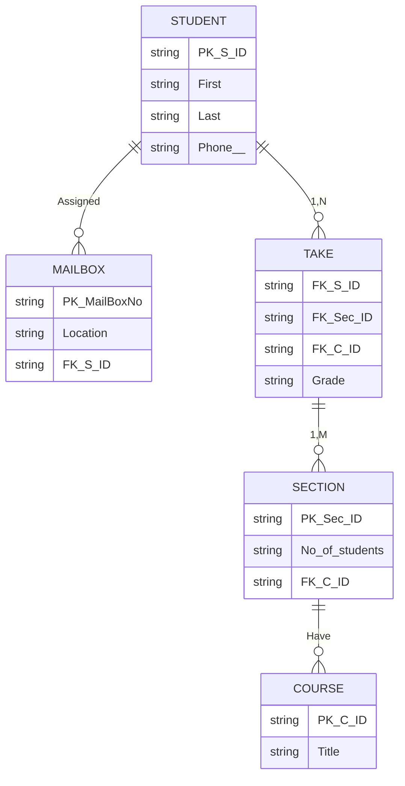

---
tags:
  - COSC-457
---
# 1
Suppose each of the following Update operations is applied directly to the database of Figure 5.6. 
Discuss all integrity constraints violated by each operation, if any, and the different ways of enforcing these constraints: (60 points)

![[Pasted image 20231005192156.png]]
## a
```
Insert < 'Robert', 'F', 'Scott', '943775543', '21-JUN-42', '2365 Newcastle Rd, Bellaire, TX', M, 58000, '888665555', 1 > into EMPLOYEE.
```
- **Entity Integrity:**
    - Ensure that the `Ssn` (943775543) is unique across the `EMPLOYEE` table.
- **Key Constraints:**
    - Ensure `Ssn` is not NULL.
- **Domain Constraints:**
    - Validate the data types and formats of all attributes.
        - Confirm '21-JUN-42' is a valid date.
- **Referential Integrity:**
    - Check that '888665555' exists as an `Ssn`.
    - Ensure '1' exists as a `Dnumber` in the respective table.
- **Additional Business Rules and Enforcement:**
    - Validate `Salary` against permissible ranges.

## b
```
Insert < 'ProductA', 4, 'Bellaire', 2 > into PROJECT.
```
- **Entity Integrity:**
    - Ensure that the `Pnumber` (4) is unique across the `PROJECT` table.
- **Key Constraints:**
    - Ensure `Pnumber` is not NULL.
- **Domain Constraints:**
    - Validate the data types and formats of all attributes.
- **Referential Integrity:**
    - Ensure '2' exists as a `Dnumber` in the `DEPARTMENT` table.

## c
```
Delete the WORKS_ON tuples with ESSN= '333445555'.
```
- **Referential Integrity:**
    - Make sure deleting these doesn’t mess up the data in other tables that might be linked to these `WORKS_ON` records. If there are dependent entities in other tables that rely on these `WORKS_ON` tuples, removing them might leave dangling references.
    - If there's a `HOURS_WORKED` table that refers to these, deleting them could break things.
- **Deletion Policies:**
    - If you set it up to CASCADE, deleting records in `WORKS_ON` could, depending on the policy, cascade deletes into related tables or set related keys to NULL.
    - Making sure deleting these records doesn’t break any business rules, such as maintaining a minimum number of projects per employee.

## d
```
Delete the EMPLOYEE tuple with SSN= '987654321'.
```
- **Referential Integrity:**
    - Must make sure that deleting this specific employee doesn't mess up tables that use this `SSN` as a reference. For example, if this `SSN` is used in other tables, deleting it could leave dangling references.
- **Deletion Policies:**
    - If the settings (like CASCADE or SET NULL) are set in a certain way, deleting this `EMPLOYEE` might delete other related records or set related keys to NULL.
    - Also, must check that deleting this employee doesn’t violate any business rules.

## e 
```
Modify the MGRSSN and MGRSTARTDATE of the DEPARTMENT tuple with DNUMBER=5 to '123456789' and '01-OCT-88', respectively.
```
- **Referential Integrity:**
    - Ensure that the new `MGRSSN` ('123456789') exists in the `EMPLOYEE` table to prevent introducing a non-existent manager reference.
- **Domain Constraints:**
    - Verify that '01-OCT-88' is a valid date format.
- **Temporal Integrity:**
    - Ensure that the new `MGRSTARTDATE` ('01-OCT-88') does not violate any temporal constraints. For instance, it should not be a future date or a date that conflicts with other temporal data in the database.
- **Business Rules:**
    - Ascertain that the update adheres to any business rules or policies, such as management assignment durations or manager eligibility.

## f
```
Modify the SUPERSSN attribute of the EMPLOYEE tuple with SSN= '999887777' to '943775543'.
```
- **Referential Integrity:**
    - Ensure that the new `SUPERSSN` ('943775543') exists in the `EMPLOYEE` table. This ensures that the new supervisor specified by `SUPERSSN` is a valid employee.
- **Hierarchical Integrity:**
    - Ensure that updating the `SUPERSSN` does not create hierarchical or managerial loops within the organization. For example, '999887777' should not be the supervisor of '943775543', directly or indirectly, to prevent a cyclical supervisory chain.
- **Business Rules:**
    - Confirm that the change adheres to any applicable business rules, such as management levels, departments, or managerial hierarchy.

# 2
![[Pasted image 20231005202952.png]]


# 3
Please convert following EERD to a schema. In each table, the primary key and foreign keys (arrows) must be identified.
![[Pasted image 20231005210427.png]]

Relationships and Associated Attributes:
1. **d**
    - Between: Vehicle and {Car, Truck, SUV} (Ternary relationship)
2. **Sale**
    - Between: Vehicle (M,1) and Salesperson (1,1) and Customer (1,M)
    - Attributes: Date


![[Pasted image 20231005210248.png]]