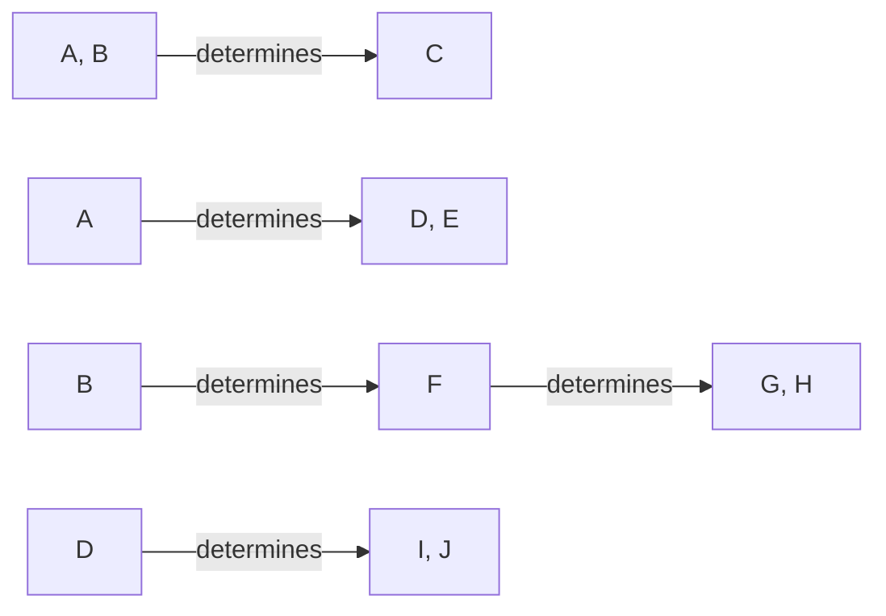
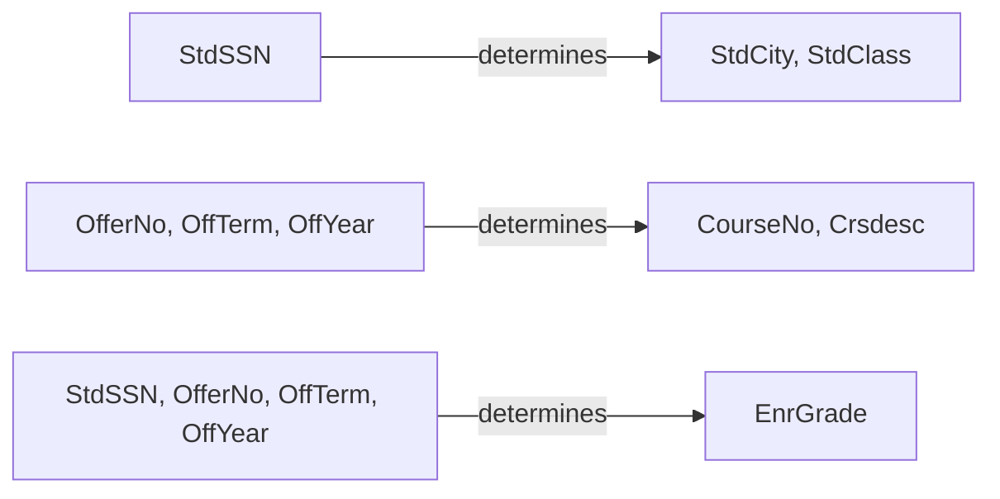
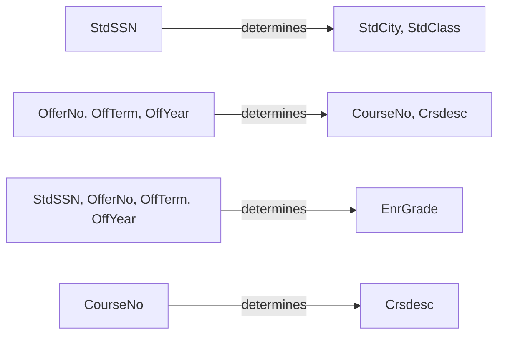

Course: COSC457-101 – Database Management Systems
Assignment#5 Normalization
Due Date: Nov 30, 2023, 11:59pm

## Normalize following table up to BCNF - 50 points
Consider the universal relation $R = \{A, B, C, D, E, F, G, H, I, J\}$

and the set of functional dependencies:
$$
\begin{align*}
	F = \{ \{A, B\} &\rightarrow \{C\}, \\
	\{A\} &\rightarrow \{D, E\}, \\
	\{B\} &\rightarrow \{F\}, \\
	\{F\} &\rightarrow \{G, H\},\\
	\{D\} &\rightarrow\{I, J\} \} \\
\end{align*}
$$
### What is the key for R? 

First relation:
$\{A, B\} \rightarrow \{C\}$
Second relation
$\{A\} \rightarrow \{D, E\},$
so...
$\{A, B\} \rightarrow \{C, D, E\}$
because $D$ and $E$ depend on just $A$

Third relation,
$\{B\} \rightarrow \{F\}$
so using the same logic as before,
$\{A, B\} \rightarrow \{C, D, E, F\}$

Fourth relation,
$\{F\} \rightarrow \{G, H\}$
since $F$ depends on $B$, then $G$ and $H$ are also included
so,
$\{A, B\} \rightarrow \{C, D, E, F, G, H\}$

Fifth relation,
$\{D\} \rightarrow\{I, J\}$
$D$ already depends on $A$, so $I$and $J$ are included
$\{A, B\} \rightarrow \{C, D, E, F, G, H, I, J\}$

Therefore, the primary key is $\{A, B\}$ since it determines all other the attributes.

### Draw the relation including functional dependencies with arrows. 

![[Pasted image 20231130202802.png | 750]]

![[Pasted image 20231130204757.png | 750]]

### Decompose R into 2NF, then 3NF relations.

### 2NF

### 3NF

## 2

| StdSSN | StdCity  | StdClass | OfferNo | OffTerm | OffYear | EnrGrade | CourseNo | Crsdesc   |
| ------ | -------- | -------- | ------- | ------- | ------- | -------- | -------- | --------- |
| S1     | SEATTLE  | JUN      | O1      | FALL    | 2003    | 3.5      | C1       | DB        |
| S1     | SEATTLE  | JUN      | O2      | FALL    | 2003    | 3.3      | C2       | VB        |
| S2     | BOTHELL  | JUN      | O3      | WINTER  | 2003    | 3.1      | C3       | OOS       |
| S2     | BOTHELL  | JUN      | O2      | FALL    | 2003    | 3.4      | C2       | VB        |
| S3     | BALTIMORE| SEN      | O4      | SPRING  | 2004    | 3.2      | C2       | VB        |

- **StdSSN:** Student’s SSN
- **StdCity:** Student’s address
- **StdClass:** {freshman, sophomore, junior, senior}
- **OfferNo:** A unique number for each class
- **OffTerm:** Term in a year (semester)
- **OffYear:** Year
- **EnrGrade:** Grade
- **CourseNo:** Course number
- **Crsdesc:** Course description

### Please find functional dependencies.
$fd1: \text{\{CourseNo\}} \rightarrow \text{\{Crsdesc\}}$
$fd2: \{\text{StdSSN}, \text{OfferNo}\} \rightarrow \text{\{EnrGrade\}}$
$fd3: \{\text{StdSSN}, \text{OfferNo}\} \rightarrow \{\text{OffTerm}, \text{OffYear}\}$
$fd4: \{\text{OfferNo}, \text{OffTerm}, \text{OffYear}\} \rightarrow \{\text{CourseNo\}}$

### Candidate and Primary Keys

- **Candidate Keys**: ${\text{\{StdSSN, OfferNo\}}, \text{\{OfferNo, OffTerm, OffYear\}}}$
- **Primary Key**: ${\text{\{StdSSN\}}, \text{\{OfferNo\}}}$

### Second Nominal Form

### Third Nominal Form

