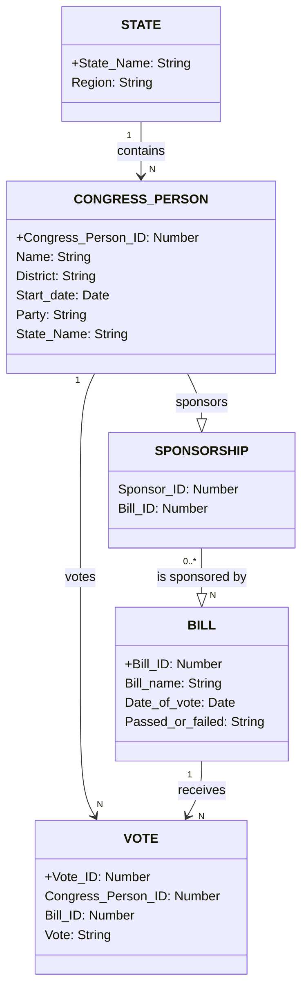
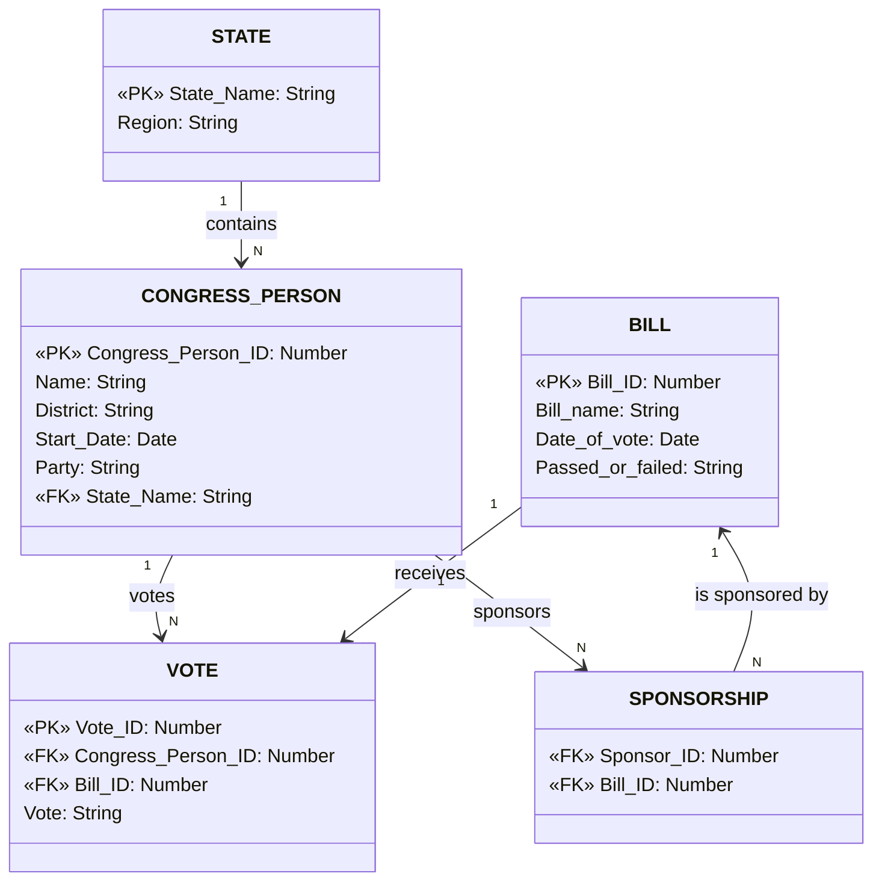
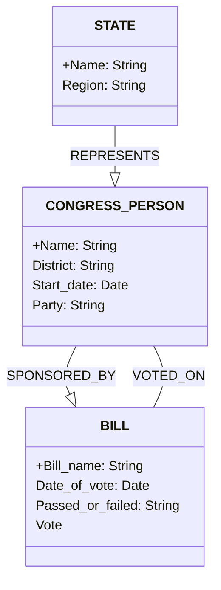
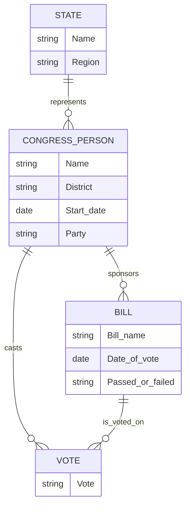

note right of CONGRESS_PERSON: + indicates Primary Key
note right of STATE: One STATE can be represented by multiple CONGRESS_PERSON
note right of CONGRESS_PERSON: One CONGRESS_PERSON can sponsor and vote on multiple BILLs
note right of BILL: One BILL can be sponsored by and voted on by multiple CONGRESS_PERSONs

