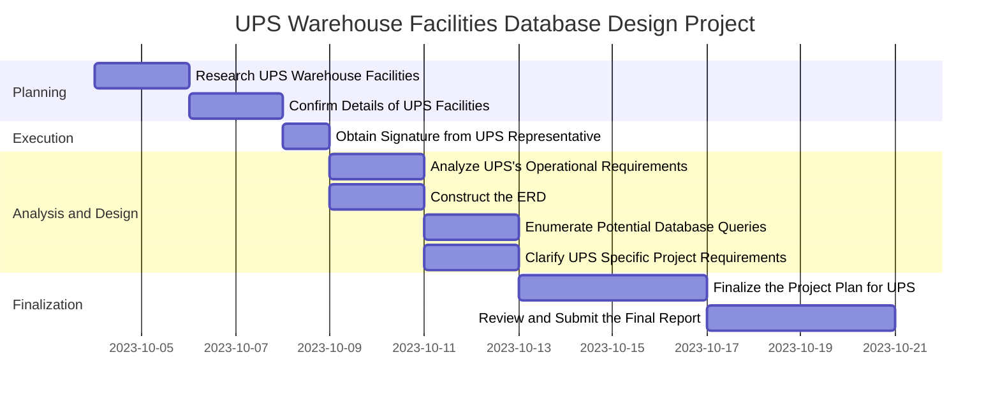

| Task Number | Task Name                                       | Duration | Start Date | Finish Date | Member Names |
| ----------- | ----------------------------------------------- | -------- | ---------- | ----------- | ------------ |
| 1           | Research UPS Warehouse Facilities               | 3 days   | 10/04/2023 | 10/06/2023  | All          |
| 2           | Confirm Details of UPS Facilities               | 2 days   | 10/07/2023 | 10/08/2023  | All          |
| 3           | Obtain Signature from UPS Representative        | 1 day    | 10/09/2023 | 10/09/2023  | Khalil       |
| 4           | Analyze UPS's Operational Requirements          | 3 days   | 10/10/2023 | 10/12/2023  | All          |
| 5           | Construct the Entity-Relationship Diagram (ERD) | 3 days   | 10/13/2023 | 10/15/2023  | Carlos       |
| 6           | Enumerate Potential Database Queries for UPS    | 2 days   | 10/16/2023 | 10/17/2023  | Sam          |
| 7           | Clarify UPS Specific Project Requirements       | 2 days   | 10/18/2023 | 10/19/2023  | All          |
| 8           | Finalize the Project Plan for UPS               | 2 days   | 10/20/2023 | 10/21/2023  | All          |
| 9           | Review and Submit the Final Report              | 1 day    | 10/25/2023 | 10/25/2023  | All          | 

Obtain signature – Khalil 
ERD – Carlos 
Database query – Sam 
Rest – all members contributed (Carlos, Khalil, Sam, and Ivan)

![[Pasted image 20231025185621.png]]