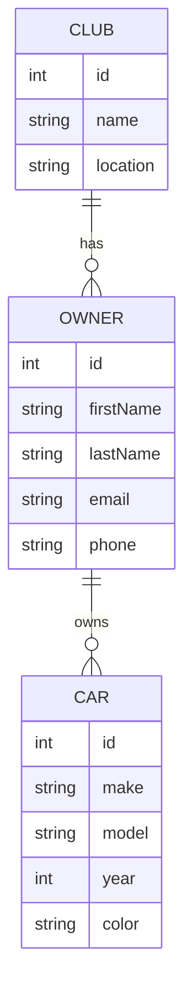

#COSC-457 #fall2023 
- **Data Definition Language (DDL):** Used by the DBA and database designers to specify the conceptual schema of a database. In many DBMSs, the DDL is also used to define internal and external schemas (or views). In some DBMSs, separate storage definition language (SDL) and view definition (VDL) are used to define internal and external schemas, respectfully

- Query Languages
- general purpose
	- COBOL, C, Java, etc.

- DDL
	- CREATE: Creates objects
	- ALTER: Alter the structure
	- DROP: Deletes objects
	- RENAME: Renames objects
- Example
```mySQL
CREATE TABLE department (
	dept_name char(20)),
	building char(15),
	number_of_employee numeric
);
DROP TABLE department;
```

## DBMS Languages - DML
- High level or non-procedural languages
	- SQL are set oriented and specify what data to retrieve than how to retrieve.
	- Called declarative languages
- Low Level Procedural Languages
	- Record-at-a-time
	- they specify *how* to retrieve the data
	- include constructs such as looping
	- PL/SQL, t-SQL

```mySQL
SELECT staffNo, fName, IName, position, salary
FROM Staff
WHERE salary > 10000;
```


## DBMS Interfaces
- Stand-alone query language interfaces
	- SQL\*Plus in Oracle
	- Programmer interfaces for embedding DML in programming langs
	- User-friendly interfaces
		- menu based
		- forms based
		- graphics-based
		- natural language



### Explanation:
1. **Entities and Attributes**:
    - `CAR`: Represents each car in the show.
        - `id`: Unique identifier for each car.
        - `make`: The make of the car (e.g., Ford, Toyota).
        - `model`: The model of the car (e.g., Mustang, Camry).
        - `year`: The year the car was made.
        - `color`: The color of the car.
    - `OWNER`: Represents each car owner attending the show.
        - `id`: Unique identifier for each owner.
        - `firstName`: The first name of the owner.
        - `lastName`: The last name of the owner.
        - `email`: The email address of the owner.
        - `phone`: The phone number of the owner.
    - `CLUB`: Represents each club participating in the show.
        - `id`: Unique identifier for each club.
        - `name`: The name of the club.
        - `location`: The location of the club.
2. **Relationships**:
    - Each `OWNER` owns one or more `CAR`s. This is represented by the `owns` relationship, which is a one-to-many relationship from `OWNER` to `CAR`.
    - Each `OWNER` has to attend the show as part of a `CLUB`. This is represented by the `has` relationship, which is a one-to-many relationship from `CLUB` to `OWNER`.

[[Entity Relationship Diagram (ERD)]]
