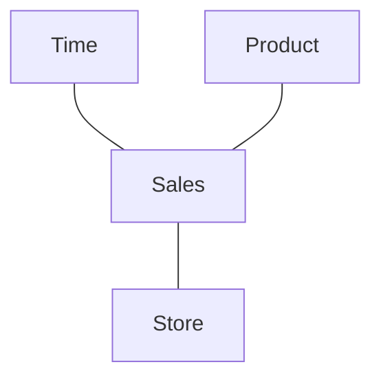
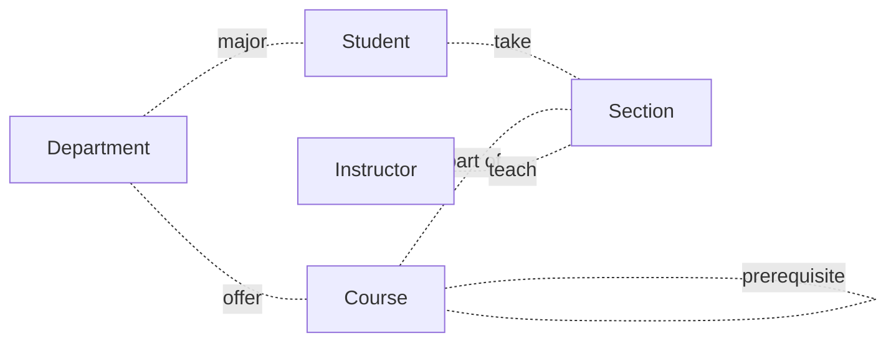

#fall2023 #COSC-457 

**LECTURE 1**

## What is a database?
> [[Database Management System]] provides <u>efficient</u>, <u>reliable</u>, <u>convenient</u>, and <u>safe</u> <u>multi-user</u> storage of and access to Massive amount of Persistent data.

- A [[Database Management System]] (Database Management System) is a software package designed to store and manage databases.

- **Massive** - Terabytes of data
- **Persistent** - Program-data independence
- **Safe** - hardware, software, etc
- **Multi-user** - Concurrency Control
- **Convenience** - Physical data independence, high-level query languages
- **Efficiency** - Thousand of queries per second
- **Reliable** - Available all the time (99.9999..%)
---
- It is a very large integrated collection of bits
- It models real-world enterprise
	- students
	- courses
- It models relationships
	- e.g., Alice is taking COSC457

---
## Files vs. Databases
- Must protect data from inconsistency due to multiple concurrent users
- Crash recovery
- Security and access control

---
## Why Use a Database?
- Data independence
- Efficient access and reduced redundancy.
- Reduced application development time.
- Data integrity and security.
- Uniform data administration.
- Concurrent access, recovery from crashes.

---
## Types of Databases and Database Applications
- Numeric and Textual Databases
- Multimedia Databases
- Geographic Databases (GIS)
- Data Warehouses
- Real-time and Active Databases

---
## Data Model Types
- Structured data model
	- Strict format with row and columns.
- Unstructured data model
	- Satellite images, scientific data
	- Social media, video, text messages, etc

---
## Basic Definitions
- Database
	- A collection of related data.
- Data
	- Known facts that can be recorded and have and implicit meaning.
- Mini-world
	- Some part of the real world about which data is stored in a database.
	- Student grades and transcripts at an university
- [[Database Management System]]
	- software package system to facilitate the creation and maintenance of a computerized database
- database system
	- The [[Database Management System]] software together with the data itself. Sometimes, the applications are also included.

---
## Typical [[Database Management System]] Functionality
- Define a database: in terms of data types, structures and constraints
- Construct or Load the Database on a secondary storage medium
- Manipulating the database: querying, generating reports, insertions, deletions and modifications to its content.
- Concurrent Processing and Sharing by a set of users and programs - yet, keeping all data valid and consistent.
---
## Data Model
- In software engineering, the term data model is used in two related senses.
	- It is a description of the objects represented by a computer system together with their properties and relationships; these are typically "real world" objects such as products, suppliers, customers, and orders.
	- In the second sense, database model, it menas a collection of concepts and rules used in defining data models: for example the relational model uses relations and tuples, while the network model uses records, sets, and fields.

---
## Data Model vs. Database
- User requirement
- Conceptual Data Model
- Logical Data Model
- Physical Data Model
- A populated physical Data Model (database)

---

## Conceptual Data Model
- Highly abstract
- Easily understood
- Easily enhanced

---

## Logical Data Model
- Attributes
- Key / non-key attributes
- User friendly attribute names
- Database agnostic

---
## Physical Data Model
- Relation
	- Table
- Attributes
	- Columns
- Database specific data types
- include indexes, constraints, etc
- Hard to port to different database, once finalized.
---
## Entity Relation Diagram (ERD)

---
## Main Characteristics of the Database Approach
- **Data Abstraction**: A data model is used to hide storage details and present the users with a conceptual view of the database.
- **Support of multiple views of the data**: Each user may see a different view of the database, which described only the data of interest to that user.
---
## Database Users
- Divided into those who:
	- actually use and control the content
		- called "actors on the scene"
	- those who enable the database to be developed and the [[Database Management System]] software to be designed and implemented
		- called "workers behind the scene"

---

