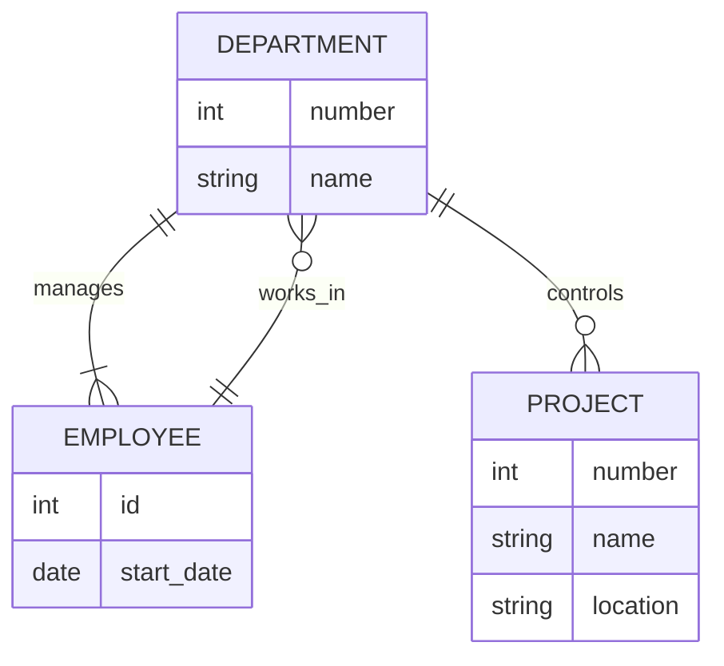

#COSC-457 #fall2023 

## Database Design
- Requirements collection and analysis
	- Interview prospective database users
	- Find out user datas requirement
- Process modeling
- Conceptual data modeling
	- Conceptual schema
- Logical data modeling
- Physical data modeling

- The company is organized into `DEPARTMENTS`. Each `department` has a `name`, a `number` and an `employee` who *manages* the department. We keep track of the `start data` of the department manager.
- Each department controls a number of `projects`. Each `project` has a `name`, a `number`, and is located at a single `location`.

This is [[How to use ERDs]] in your [[Database Management System]]