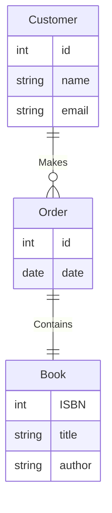

---
tags:
  - COSC-457
  - fall2023
---

[[Entity Relationship Diagram (ERD)]]s are graphical representations that model data in a clear and logical manner. They are widely used in database design to outline the structure of a database, illustrating entities, attributes, and relationships between entities.

## Key Concepts

### Entity

- **Definition**: An entity is a real-world object or concept that can be stored in a database.
- **Symbol**: Rectangle
- **Example**: `Customer`, `Order`, `Product`

```plaintext
+-----------+
|  Entity   |
+-----------+
```

### Attribute

- **Definition**: An attribute is a property or characteristic of an entity.
- **Symbol**: Oval
- **Example**: `CustomerID`, `Name`, `Email`

```plaintext
  /-------\
( Attribute )
  \-------/
```

### Relationship

- **Definition**: A relationship illustrates how entities are connected to each other.
- **Symbol**: Diamond
- **Example**: `Purchases`, `Contains`

```plaintext
   /-------\
  /         \
< Relationship >
  \         /
   \-------/
```

---

## Types of Relationships

1. **One-to-One (1:1)**: Each entity in Entity A is associated with one, and only one, entity in Entity B.

2. **One-to-Many (1:M)**: One entity in Entity A is associated with zero, one, or multiple entities in Entity B.

3. **Many-to-Many (M:N)**: One entity in Entity A is associated with multiple entities in Entity B and vice versa.

---

## ER Diagram Example with Mermaid

Consider a simple bookstore system with entities: `Book`, `Customer`, and `Order`. A customer can make multiple orders, and an order can contain multiple books.



---

## Steps to Draw an ER Diagram

1. **Identify Entities**: Look at the requirements and identify which objects should be modeled as entities.
2. **Identify Attributes**: For each entity, list down the attributes.
3. **Identify Relationships**: Establish the relationships between entities.
4. **Set Cardinality**: Define the type of relationship (1:1, 1:M, M:N).
5. **Draw the Diagram**: Use software or paper to create the diagram.

---
![[summary_ER_notation.jpeg]]


### How to use Mermaid
### [[🧜‍♀️ Mermaid Syntax]]
