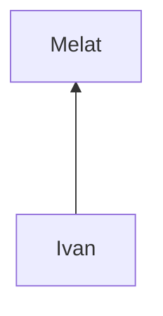

#fall2023 #MATH-330 

- **Definition**: Conditional probability is the probability of an event A occurring given that another event B has already occurred.
- **Notation**: $P(A|B)$
- **Formula**: 
$$ 
  P(A|B) = \frac{P(A\cap B)}{P(B)}
$$
where $P(B) \neq 0$

- **Sample Space (S)**: The set of all possible outcomes of an experiment.

#### Example: "Find the probability that we successfully draw 2 red cards (without replacement)"

Assume we're dealing with a standard deck of 52 cards with 26 red cards (13 hearts and 13 diamonds) and 26 black cards (13 spades and 13 clubs).

- Let $P(A)$ = "the first draw is a red card"
- Let $P(B)$ = "the second draw is a red card"

**Step 1:** Calculate $P(A)$ and $P(B|A)$

- $P(A) = \frac{26}{52} = \frac{1}{2}$
- After first red card is drawn, there are 25 red cards left out of 51 total cards.)

**Step 2:** Use the formula 
$$
P(A\cap B) = P(A) \times P(B|A)
$$

- $P(A\cap B) = \frac{1}{2} \times \frac{25}{51}$​
- $P(A\cap B) = \frac{25}{102}$
So, the probability of successfully drawing 2 red cards without replacement is $\frac{25}{102}$​.

- Let \( A \) = "the first draw is a red card"
- Let \( B \) = "the second draw is a red card"
- Let \( C \) = "the third draw is a black card"

The sample space \( S \) remains the same, with 52 cards (26 red and 26 black).

**Step 1:** Calculate the probabilities of \( A \), \( B|A \), and \( C|A \cap B \):

- $P(A) = \frac{26}{52} = \frac{1}{2}$
- $P(B|A) = \frac{25}{51}$ (25 red cards left out of 51 remaining cards)
- $P(C|A \cap B) = \frac{26}{50}$ (26 black cards left out of 50 remaining cards)

**Step 2:** Use the formula to find
$P(A \cap B \cap C)$

$$
P(A \cap B \cap C) = P(A) \times P(B|A) \times P(C|A \cap B)
$$

$$
P(A \cap B \cap C) = \frac{1}{2} \times \frac{25}{51} \times \frac{26}{50}
$$

$$
P(A \cap B \cap C) = \frac{1}{2} \times \frac{1}{2.04} \times \frac{1}{1.923}
$$

$$
P(A \cap B \cap C) \approx \frac{1}{2} \times \frac{0.9804}{1} \times \frac{0.5196}{1}
$$

$$
P(A \cap B \cap C) \approx \frac{0.5098}{2}
$$

$$
P(A \cap B \cap C) \approx 0.2549
$$
So, the probability of drawing 2 red cards first and then a black card from a standard deck without replacement is approximately `0.2549` or about `25.49%`

### Fair Die
$S = \{1, 2, 3, 4, 5, 6\}$
$A = \{2, 4, 6\}$
$B = \{3, 4, 5, 6\}$
$A \cap B = \{4, 6\}$ 
- Are A and B independent? Yes
$P(A) = 1/2, P(A \cap B) = 2/6$
$P(B) = 4/6$
$P(A|B) = \frac{2/6}{4/6} = 1/2 = P(A)$
$A \cap B \neq \emptyset$

