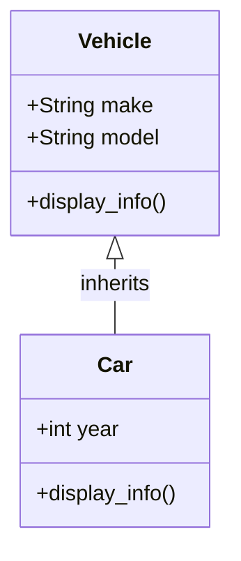

---
tags:
  - spring2024
  - COSC-436
---

Inheritance is core concept in [[Object Oriented Programming]] that allows a **class** to inherit **attributes** and **methods** from another class. 

The class from which attributes and methods are inherited is called the **parent class**, and the class that inherits those attributes and methods is called the child class. 

Inheritance promotes code reuse and can make code more organized and manageable.



```python
class Vehicle:  # Parent class
    def __init__(self, make, model):
        self.make = make
        self.model = model

    def display_info(self):
        print(f"Make: {self.make}, Model: {self.model}")

class Car(Vehicle):  # Child class
    def __init__(self, make, model, year):
        super().__init__(make, model)  # Call to the parent class constructor
        self.year = year

    def display_info(self):
        super().display_info()  # Call to the parent class method
        print(f"Year: {self.year}")

# Creating an instance
my_car = Car("Toyota", "Corolla", 2020)
my_car.display_info()

```


