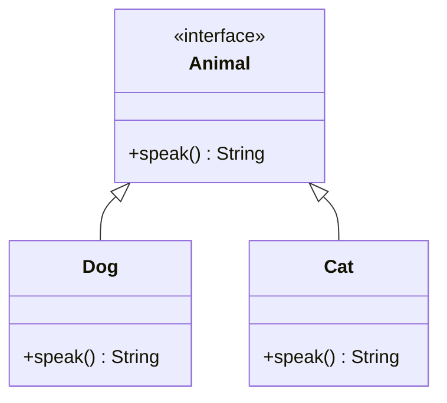

Polymorphism is an [[Object Oriented Programming]] concept that allows objects of different classes to be treated as objects of a common superclass. 

It is derived from the Greek words "poly" (many) and "morph" (form), meaning **many forms**. 

In programming, it enables a single interface to represent different underlying forms (data types). 

There are two types of polymorphism: 
- **compile-time** (or static) polymorphism and
	- *Method overloading* is an example of compile-time polymorphism
- **runtime** (or dynamic) polymorphism. 
	- *method overriding* is an example of runtime polymorphism.


## Graph



## Code Example (Python)

```python
class Animal:
    def speak(self):
        pass

class Dog(Animal):
    def speak(self):
        return "Woof!"

class Cat(Animal):
    def speak(self):
        return "Meow!"

def animal_sound(animal):
    print(animal.speak())

# Creating instances
dog = Dog()
cat = Cat()

# Demonstrating polymorphism
animal_sound(dog)  # Outputs: Woof!
animal_sound(cat)  # Outputs: Meow!
