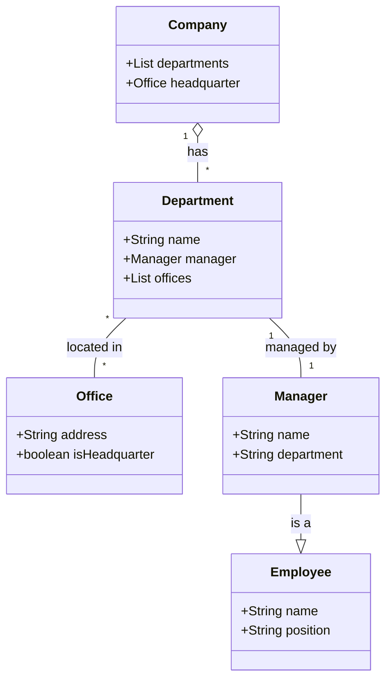
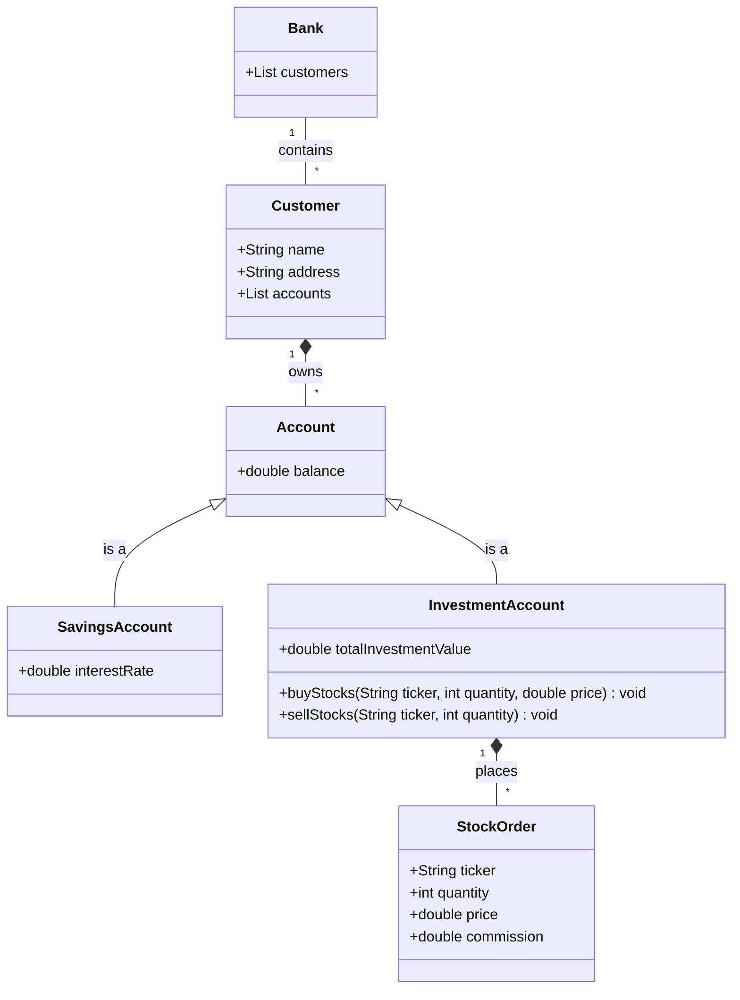

```mermaid
classDiagram
    class Company {
        +List<Department> departments
        +Office headquarter
    }
    class Department {
        +String name
        +Manager manager
        +List<Office> offices
    }
    class Office {
        +String address
        +boolean isHeadquarter
    }
    class Manager {
        +String name
        +String department
    }
    class Employee {
        +String name
        +String position
    }
    Company "1" o-- "*" Department : has
    Department "1" -- "1" Manager : managed by
    Department "*" -- "*" Office : located in
    Manager --|> Employee : is a

```

```mermaid
classDiagram
    class Bank {
        +List<Customer> customers
    }
    class Customer {
        +String name
        +String address
        +List<Account> accounts
    }
    class Account {
        +double balance
    }
    class SavingsAccount {
        +double interestRate
    }
    class InvestmentAccount {
        +double totalInvestmentValue
        +buyStocks(String ticker, int quantity, double price) void
        +sellStocks(String ticker, int quantity) void
    }
    class StockOrder {
        +String ticker
        +int quantity
        +double price
        +double commission
    }
    Bank "1" -- "*" Customer : contains
    Customer "1" *-- "*" Account : owns
    Account <|-- SavingsAccount : is a
    Account <|-- InvestmentAccount : is a
    InvestmentAccount "1" *-- "*" StockOrder : places

```

