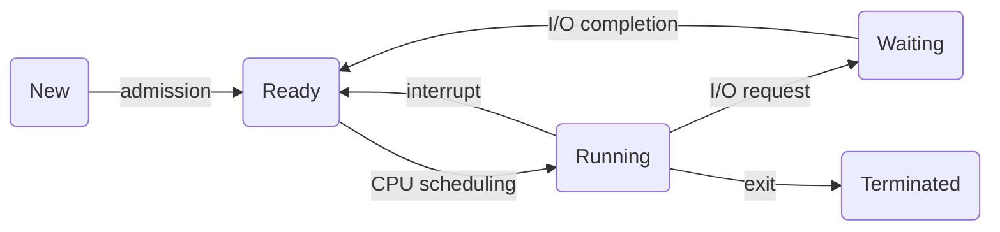
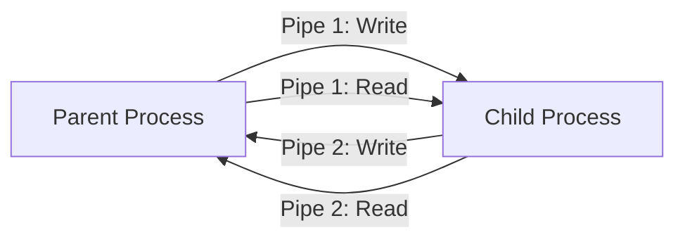
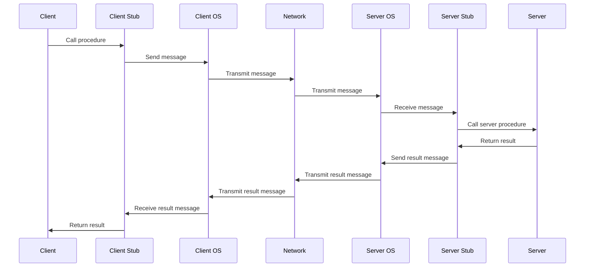

---
tags:
  - spring2024
  - COSC-439
---


```
1. Define "program," "process," and "thread," providing a real-world example for each. Elaborate on the reasons for preferring multithreading over multiprocessing.
2. Describe the Process Control Block (PCB) and illustrate the various process states and their transitions using a diagram.
3. Describe the Process Control Block (PCB) and Illustrate how the Central Processing Unit (CPU) switches from one process to another by explaining the PCB and using a diagram.
4. Define process scheduling, draw and explain a queuing diagram.
5. Explain Inter-Process Communication (IPC) through both message passing and shared memory methods. Explain direct and indirect message sharing concept using “send” and “receive”.
6. Define a "pipe" and explain bi-directional communication between child and parent processes using an ordinary pipe. Include a diagram. [hint: two pipes]
7. Explain the execution steps of a Remote Procedure Call (RPC) with a diagram.
8. What are the benefits of thread? List the common methods for mapping user threads to kernel threads. List three disadvantages of such mappings.
9. Describe "fork" and "exec" using two small code snippets, ensuring the code contains essential segments. (don’t worry about the syntax errors).
```


## 1. Defining program, process, and threads, multithreading vs multiprocessing

- Program: A program is a set of instructions usually written in a high-level language like Java, C, Python. It can be a file, or collection of files that contains written instructions (code) that need to be executed.
	- Examples: Chrome browser, or notepad application. Sits in your application folder as an executable file until you run it.
- Process: A process is essentially an instance of said program that is loaded into memory. When you run a program, the operating system allocates memory and resources to the program, turning it into a process. Each process has their own memory address and runs independently from any other process.
	- Example: Running two instances of notepad spawns two notepad processes that run independently from one another.
- Thread: A thread is the smallest unit of a process. It shares memory and resources with other threads of that process but operate indifferently. Threads running from the same process can share data more easily than two processes can.
	- Example: In a browser like chrome, one thread could be displaying the graphics on the screen, one can be playing audio, and one can be fetching data from the network.

Why is multithreading often preferred over multiprocessing?

- **Resource efficiency**: When you multithread, you share memory and resources within a process. This makes context switching more efficient - because it takes less time in terms of memory and speed to switch between them than between multiple processes.
- **Simplified communication**: Since threads share the same memory space, it is easier for them to communicate between each other because they can write and *read from the same memory space*. Multiprocessing requires *special inter-process communication mechanisms* like **pipes** and **sockets**, that are more complex to use and implement.
- **Responsiveness**: In applications like a GUI or programs that need multiple tasks done seemlessly at once, multithreading can help by allowing a thread to handle user interaction while others work in the background (like rendering graphics or playing sound).

## 2. 




## Pipes




