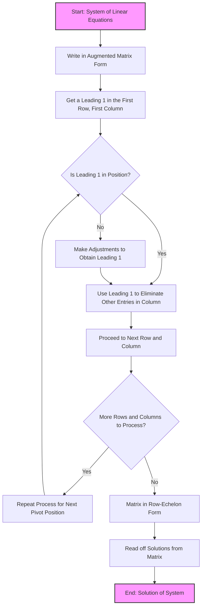

## Overview

Elementary row operations are used to solve a system of linear equations by transforming the system into an augmented matrix and then manipulating this matrix to find the solution.

## Steps

1. **Convert to Augmented Matrix**
   Transform the system of linear equations into an augmented matrix.

2. **Row Echelon Form**
   Use elementary row operations to transform the matrix into row echelon form. The operations include:
   - Row swapping (Ri ↔ Rj)
   - Row multiplication (kRi → Ri, k ≠ 0)
   - Row addition (Ri + kRj → Ri)

3. **Leading 1s and Elimination**
   Obtain a leading 1 in each row (pivot position) and use it to eliminate other entries in its column.

4. **Back Substitution**
   Once the matrix is in row-echelon form, read off the solutions.

## Elementary Row Operations

- **Row Swap (Ri ↔ Rj):** Swap two rows.
- **Row Multiply (kRi → Ri):** Multiply a row by a non-zero constant.
- **Row Addition (Ri + kRj → Ri):** Add a multiple of one row to another row.

## Example Problems

### Example 1

Solve the system:

$$
x_1 + 2x_2 = 4 \\
3x_1 - x_2 = 1
$$

**Solution:**

1. Augmented Matrix: $\begin{bmatrix} 1 & 2 & | & 4 \\ 3 & -1 & | & 1 \end{bmatrix}$
2. R2 → R2 - 3R1: $\begin{bmatrix} 1 & 2 & | & 4 \\ 0 & -7 & | & -11 \end{bmatrix}$
3. R2 → R2 / -7: $\begin{bmatrix} 1 & 2 & | & 4 \\ 0 & 1 & | & \frac{11}{7} \end{bmatrix}$
4. R1 → R1 - 2R2: $\begin{bmatrix} 1 & 0 & | & \frac{6}{7} \\ 0 & 1 & | & \frac{11}{7} \end{bmatrix}$
5. Solutions: $x_1 = \frac{6}{7}, x_2 = \frac{11}{7}$

### Example 2

Solve the system:

$$
2x_1 - 4x_2 = -2 \\
4x_1 + 5x_2 = 3
$$

**Solution:**

1. Augmented Matrix: $$\begin{bmatrix} 2 & -4 & | & -2 \\ 4 & 5 & | & 3 \end{bmatrix}$$
2. R1 → R1 / 2: $$\begin{bmatrix} 1 & -2 & | & -1 \\ 4 & 5 & | & 3 \end{bmatrix}$$
3. R2 → R2 - 4R1: $$\begin{bmatrix} 1 & -2 & | & -1 \\ 0 & 13 & | & 7 \end{bmatrix}$$
4. R2 → R2 / 13: $$\begin{bmatrix} 1 & -2 & | & -1 \\ 0 & 1 & | & \frac{7}{13} \end{bmatrix}$$
5. R1 → R1 + 2R2: $$\begin{bmatrix} 1 & 0 & | & \frac{3}{13} \\ 0 & 1 & | & \frac{7}{13} \end{bmatrix}$$
6. Solutions: $$x_1 = \frac{3}{13}, x_2 = \frac{7}{13}$$

## Flowchart 

